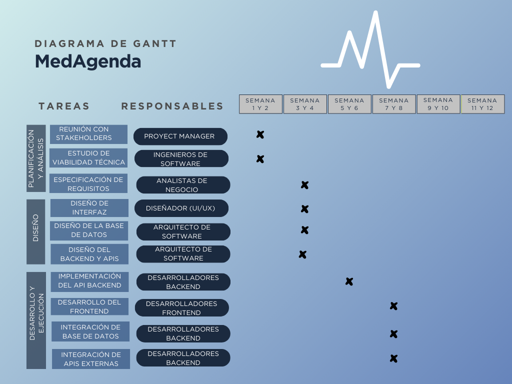
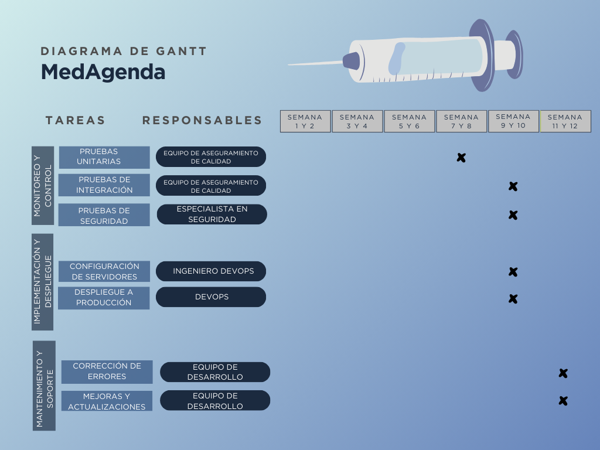

# MedAgenda.
## Repositorio oficial de MedAgenda
**Por**: Santiago Jiménez Cotrini, Miguel Suárez Obando, Diana Sofía Paque, Daniel Giraldo Valencia

#### Instalación
```
$ git clone https://github.com/pier123gv/MedAgenda.git
$ cd MedAgenda
$ npm install
$ npm run dev
```
### OBJETIVOS

- Diseñar un software para administrar y gestionar de manera eficiente las agendas, citas, fórmulas y disponibilidad médica para consultorios independientes de especialistas de la salud.
- Desarrollar un sistema de comunicación integral para pacientes y especialistas, que permita la emisión y recepción de datos relevantes a través de diferentes canales, como correos electrónicos y números de celular.
- Optimizar la gestión administrativa y mejorar la experiencia de los pacientes y del personal médico, ofreciendo un servicio organizado y accesible.
- Facilitar el acceso, modificación y almacenamiento del historial y registro médico.
- Conectar el software con sistemas de facturación para automatizar el cobro de citas y servicios, generando facturas electrónicas.
- Implementar medidas de seguridad para proteger la información médica y personal de los pacientes, cumpliendo con las normativas de protección de datos.

### ALCANCE

#### Comunicación con pacientes

El sistema permitirá a los pacientes agendar, cancelar o cambiar sus citas de manera digital, ya sea desde una computadora o un dispositivo móvil. Además, recibirán recordatorios automáticos y confirmaciones por correo electrónico o WhatsApp, lo que reducirá la posibilidad de que olviden sus citas. Si hay cambios en las citas o recordatorios de seguimiento, los pacientes serán informados de manera inmediata.

También podrán recibir enlaces que faciliten el pago de los servicios médicos, lo que hará todo el proceso más sencillo y conveniente.

#### Envío de Recetas Médicas

Los médicos podrán generar y enviar recetas médicas electrónicas a sus pacientes de forma rápida y segura. El sistema también permitirá que los médicos consulten recetas previas, facilitando el seguimiento del tratamiento a lo largo del tiempo.

#### Facilidades para los médicos

Los médicos tendrán acceso a su agenda de citas de manera clara y organizada, lo que les permitirá gestionar su tiempo de forma más eficiente.

#### Seguridad y Privacidad

Se implementarán medidas rigurosas para proteger la información médica y personal de los pacientes, cumpliendo con las leyes y normativas de protección de datos.

### STAKEHOLDERS

- Doctores independientes dueños de clínicas pequeñas.
- Clínicas de mayor escala que buscan nuevas funcionalidades.
- Clínicas en crecimiento interesadas en escalar su negocio.
- Usuarios que requieran servicios médicos.

### BENEFICIOS ESPERADOS

- Mejora en la Eficiencia Operativa.
- Optimización de la Gestión del Paciente.
- Mejor Experiencia del Paciente.
- Automatización de la Facturación.
- Escalabilidad y Adaptabilidad del Software.
- Reducción de Costos Operativos.

### RECURSOS

#### Equipo de Desarrollo

- Desarrolladores Full Stack.
- Diseñador de UI/UX.
- Arquitecto de Software.
- Especialistas en Seguridad.
- Tester / QA.

#### Infraestructura y Tecnologías

- Servidores/Cloud: AWS, Google Cloud o Azure.
- Base de Datos: PostgreSQL.
- Plataformas de Mensajería: Twilio o SendGrid.
- Sistemas de Pago: Transferencias de Bancolombia o MercadoPago.
- Sistema de Seguridad.
- Herramientas de Colaboración: GitHub, GitLab o Bitbucket.

### REQUISITOS

#### Funcionales

1. Los pacientes deben poder agendar, modificar y cancelar las citas en línea.
2. El sistema debe contar con un sistema de notificación tanto para pacientes como para doctores y administradores.
3. El sistema de notificación para pacientes debe enviar recordatorios, horarios y fórmulas automáticamente.
4. Los médicos deben poder definir y actualizar su disponibilidad.
5. Los médicos deben poder generar y enviar recetas médicas electrónicas.
6. El sistema debe almacenar el historial médico de cada paciente.
7. El sistema debe generar facturas automáticamente.

#### No Funcionales

1. El sistema debe contar con la asesoría de un equipo de ciberseguridad.
2. Las funcionalidades deben estar separadas en módulos.
3. El sistema debe soportar múltiples usuarios simultáneamente.

### DIAGRAMA DE GANTT


[Enlace al diagrama](https://www.canva.com/design/DAGQPh_qNQQ/Rbu3AOmnt8hT6ZFNCmDjCg/edit?utm_content=DAGQPh_qNQQ&utm_campaign=designshare&utm_medium=link2&utm_source=sharebutton)

### PRESENTACIÓN METODOLOGÍA ÁGIL

[Enlace a la presentación](https://www.canva.com/design/DAGQrOxWmjY/3qUuUFw4Tre6r0SSpwdsxQ/edit?utm_content=DAGQrOxWmjY&utm_campaign=designshare&utm_medium=link2&utm_source=sharebutton)

## User Stories y Tareas

1. **Perfil de Usuario**  
   - Como **usuario**, quiero poder ver y actualizar mi perfil para mantener mi información al día.
   - **Tareas**: Crear la interfaz del perfil de usuario - Implementar la lógica para editar y guardar la información del perfil.

2. **Funcionalidad para Agendar Citas**  
   - Como **paciente**, quiero poder agendar una cita médica de acuerdo con la disponibilidad para programar fácilmente mis consultas.
   - **Tareas**: Crear el formulario para agendar citas - Implementar la lógica para seleccionar fecha, hora y médico.

3. **Buscador de Médicos**  
   - Como **usuario**, quiero buscar médicos según especialidad y ubicación para encontrar fácilmente un médico que se ajuste a mis necesidades.
   - **Tareas**: Diseñar el buscador - Implementar filtros por especialidad y ubicación.

4. **Tablero Administrativo con Calendario**  
   - Como **médico**, quiero tener un calendario que muestre mis citas para gestionar mejor mi agenda.
   - **Tareas**: Implementar un calendario interactivo - Integrar la visualización y edición de citas en el calendario.

5. **Registro de Usuario**  
   - Como **nuevo usuario**, quiero poder registrarme en la plataforma con mi correo y contraseña para acceder a los servicios médicos.
   - **Tareas**:
     - Diseñar e implementar el formulario de registro - Implementar la validación de datos y el almacenamiento de la información del usuario.

6. **Login de Usuario**  
   - Como **usuario registrado**, quiero poder iniciar sesión para acceder a mi cuenta y agendar citas.
   - **Tareas**: Crear el formulario de login - Implementar la autenticación de usuarios.

7. **Notificaciones de Recordatorio de Cita**  
   - Como **paciente**, quiero recibir recordatorios automáticos de mis citas médicas para no olvidarlas.
   - **Tareas**: Integrar una API de notificaciones (correo o SMS) - Implementar lógica para enviar recordatorios antes de cada cita.

8. **Generación de Recetas Médicas**  
   - Como **médico**, quiero poder generar recetas médicas electrónicas para enviarlas directamente a mis pacientes.
   - **Tareas**: Diseñar el formulario para que los médicos creen recetas - Implementar la generación de recetas electrónicas y el envío al paciente.

9. **Visualización del Historial de Citas**  
   - Como **paciente**, quiero poder ver el historial de mis citas médicas para tener un registro de mis consultas.
   - **Tareas**: Crear una interfaz para listar todas las citas anteriores - Integrar los datos de citas pasadas con la base de datos (una vez implementada).

10. **Gestión de Disponibilidad de Médicos**  
    - Como **médico**, quiero poder definir y actualizar mi disponibilidad para que los pacientes puedan agendar citas en horarios correctos.
    - **Tareas**: Implementar la lógica para que los médicos definan su horario disponible - Actualizar la interfaz de agendamiento para reflejar la disponibilidad actual.

11. **Sistema de Pago de Citas**  
    - Como **paciente**, quiero pagar mi cita en línea para facilitar el proceso de cobro.
    - **Tareas**: Integrar una API de pagos (MercadoPago, PayU) - Implementar el proceso de generación de facturas después de cada pago.

12. **Generación Automática de Facturas**  
    - Como **administrador**, quiero generar facturas automáticas para tener un registro de los cobros y facilitar la contabilidad.
    - **Tareas**: Implementar la generación automática de facturas después de una cita - Crear una sección en el tablero administrativo para revisar las facturas generadas.

13. **Acceso Seguro a la Información Médica**  
    - Como **paciente**, quiero que mi información médica esté protegida por medidas de seguridad para garantizar que mis datos sean privados.
    - **Tareas**: Implementar la autenticación de dos factores (2FA) para el acceso - Asegurar la conexión con certificados SSL/TLS.

14. **Reportes de Rendimiento para Médicos**  
    - Como **administrador**, quiero generar reportes del rendimiento de los médicos (número de citas, evaluaciones de pacientes, etc.) para mejorar la gestión.
    - **Tareas**: Implementar un sistema de reportes dentro del tablero administrativo - Integrar gráficos y estadísticas sobre el rendimiento médico.

15. **Cancelación de Citas**  
    - Como **paciente**, quiero poder cancelar mis citas en línea para que otras personas puedan aprovechar ese espacio.
    - **Tareas**: Diseñar una opción para que los pacientes cancelen citas desde su perfil - Implementar la lógica para liberar la disponibilidad en el calendario.

16. **Modificación de Citas**  
    - Como **paciente**, quiero poder modificar la fecha u hora de una cita ya agendada en caso de necesitar hacer cambios.
    - **Tareas**: Crear una funcionalidad para modificar citas desde el perfil del paciente - Actualizar la agenda del médico con los cambios.

17. **Visualización de Recetas Médicas**  
    - Como **paciente**, quiero poder consultar mis recetas médicas anteriores para facilitar la continuidad de mi tratamiento.
    - **Tareas**: Crear una interfaz para ver recetas médicas pasadas - Integrar el sistema de recetas con el historial del paciente.

18. **Soporte Técnico Básico para Usuarios**  
    - Como **usuario**, quiero tener acceso a soporte técnico básico para resolver problemas comunes con la plataforma.
    - **Tareas**: Crear una sección de preguntas frecuentes (FAQ) - Implementar un sistema de tickets de soporte básico.

19. **Dashboard de Notificaciones**  
    - Como **administrador**, quiero tener acceso a un tablero que me permita ver todas las notificaciones pendientes o enviadas para poder gestionar la comunicación con los pacientes.
    - **Tareas**: Crear un tablero de administración para gestionar y revisar notificaciones - Implementar filtros para notificaciones enviadas, fallidas o pendientes.

20. **Conexión con APIs de Sistemas Médicos**  
    - Como **administrador de la clínica**, quiero conectar el sistema con otras plataformas médicas para sincronizar información automáticamente.
    - **Tareas**: Investigar y conectar APIs externas con sistemas de gestión médica - Implementar la lógica para sincronizar datos entre plataformas.
## Lista de tareas:
| Nº  | Tarea                                                | Dificultad (1-5) |
| --- | ---------------------------------------------------- | ---------------- |
| ~~1~~   | ~~Diseñar y desarrollar el Landing Page~~            | ~~2~~                |
| ~~2~~   | ~~Crear la interfaz de login y registro (sin funcionalidad)~~ | ~~2~~                |
| ~~3~~   | ~~Diseñar la estructura de la base de datos~~            | ~~4~~                |
| ~~4~~   | ~~Implementar la conexión entre el backend y la base de datos (MySQL)~~ | ~~4~~                |
| 5   | Crear APIs RESTful para la gestión de citas, usuarios y recetas médicas | 5                |
| 6   | Implementar la validación de datos de usuario en el registro | 2                |
| 7   | Conectar el registro con la base de datos            | 3                |
| ~~8~~   | ~~Crear el formulario de login~~                         | ~~2~~                |
| 9   | Implementar la lógica de autenticación de usuarios   | 3                |
| 10  | Implementar manejo de sesiones seguras               | 4                |
| 11  | Proteger la plataforma con autenticación de dos factores (2FA) | 5                |
| 12  | Crear la interfaz del perfil de usuario              | 2                |
| 13  | Implementar la lógica para editar y guardar el perfil de usuario | 3                |
| 14  | Conectar el perfil con la base de datos              | 3                |
| 15  | Implementar el formulario para agendar citas         | 3                |
| 16  | Implementar la lógica para seleccionar fecha, hora y médico | 4                |
| 17  | Conectar la funcionalidad para agendar citas con la base de datos | 4                |
| 18  | Crear el buscador de médicos                         | 2                |
| 19  | Implementar filtros por especialidad y ubicación en el buscador | 3                |
| 20  | Conectar el buscador de médicos con la base de datos | 3                |
| 21  | Crear el calendario interactivo para los médicos     | 4                |
| 22  | Conectar el calendario con las citas programadas     | 4                |
| 23  | Implementar la edición y cancelación de citas en el calendario | 4                |
| 24  | Implementar la generación automática de facturas después de una cita | 4                |
| 25  | Crear una sección en el tablero administrativo para revisar facturas | 3                |
| 26  | Integrar una API de pagos (MercadoPago, PayU)        | 5                |
| 27  | Crear la interfaz para gestionar pagos de citas      | 3                |
| 28  | Almacenar transacciones en la base de datos          | 3                |
| 29  | Implementar la API de notificaciones (correo o SMS)  | 4                |
| 30  | Implementar recordatorios automáticos antes de la cita | 3                |
| 31  | Crear la funcionalidad para que los usuarios gestionen sus preferencias de notificación | 3                |
| 32  | Diseñar el formulario para que los médicos creen recetas | 2                |
| 33  | Implementar la generación de recetas electrónicas    | 3                |
| 34  | Enviar recetas electrónicas a los pacientes          | 3                |
| 35  | Guardar un historial de recetas en la base de datos  | 3                |
| 37  | Asegurar todas las conexiones con certificados SSL/TLS | 5                |
| 38  | Implementar roles y permisos para médicos, pacientes y administradores | 4                |
| 39  | Realizar auditorías de seguridad periódicas          | 3                |
| 40  | Implementar pruebas unitarias                        | 3                |
| 41  | Crear pruebas de integración para frontend y backend | 4                |
| 42  | Realizar pruebas de carga para verificar el rendimiento | 4                |
| 43  | Hacer pruebas de seguridad                           | 4                |
| 44  | Configurar integración continua (CI) para ejecutar pruebas automáticas | 4                |
| 45  | Configurar despliegue automático (CD) en un entorno en la nube | 5                |
| 46  | Crear documentación técnica para desarrolladores     | 2                |
| 47  | Documentar el uso de las APIs para integraciones de terceros | 3                |
| 48  | Mantener actualizada la documentación del código     | 1                |
| 49  | Investigar y conectar APIs externas con sistemas de gestión médica | 4                |
| 50  | Implementar la lógica para sincronizar datos entre plataformas | 4                |
| 51  | Configurar herramientas de monitoreo para medir el rendimiento | 4                |
| 52  | Implementar alertas automáticas para detectar problemas críticos | 4                |

## Distribución de responsabilidades:
| Fecha  | Miguel Suarez | Santiago Cotrini | Diana Paque | Daniel Giraldo | Observaciones |
|:------:|:-------------:|:----------------:|:-----------:|:--------------:|:-------------:|
| 25/10  | 3             | 4                | 6           | 5              | Ninguna       |
| 29/10  | 7, 12         | 8                | 9           | 10, 11         | Ninguna       |
| 1/11   | 18, 19        | 17               | 20, 22      | 16             | Ninguna       |
| 5/11   | 26            | 27               | 28          | 23, 24         | Ninguna       |
| 8/11   | 30, 31        | 33               | 32, 34      | 29             | Ninguna       |
| 12/11  | 36            | 37               | 38          | 35             | Ninguna       |
| 15/11  | 40            | 39               | 41          | 42             | Ninguna       |
| 19/11  | 44            | 43               | 46, 47      | 45             | Ninguna       |
| 22/11  | 49            | 48               | 50          | 51, 52         | Ninguna       |


